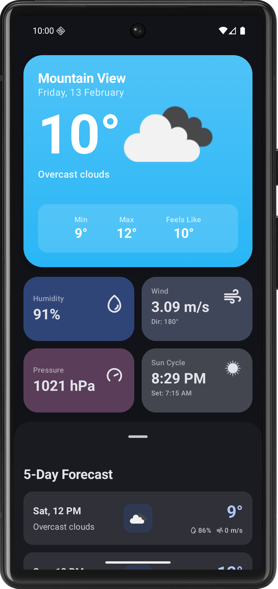
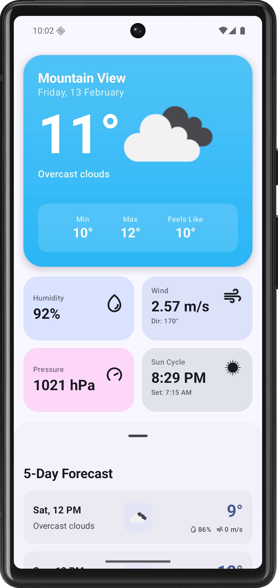

# SkyCast 🌦️

[](https://android-arsenal.com/api?level=26)
[](http://kotlinlang.org)
[](https://developer.android.com/jetpack/compose)
[](https://choosealicense.com/licenses/mit/)

SkyCast is a beautiful and simple weather forecast application for Android, built with modern technologies to provide a seamless and intuitive user experience.

## ✨ Features

*   **Real-time Weather:** Get up-to-date weather information for your current location.
*   **5-Day Forecast:** Plan your week with a detailed 5-day weather forecast.
*   **Dynamic UI:** The user interface changes based on the current weather conditions and time of day.
*   **Location-Based:** Automatically detects your location to provide accurate weather data.
*   **Clean & Modern UI:** Aesthetically pleasing design that is easy to navigate.

## 📱 Screenshots

<p align="center">
  
  &nbsp; &nbsp; &nbsp; &nbsp;
  
</p>

## 🛠️ Tech Stack

| Component        | Link                                                                                                                        |
|------------------|-----------------------------------------------------------------------------------------------------------------------------|
| **UI**           | [Jetpack Compose](https://developer.android.com/jetpack/compose)                                                            |
| **Architecture** | [MVVM (Model-View-ViewModel)](https://developer.android.com/jetpack/guide)                                                  |
| **Asynchronous** | [Coroutines](https://kotlinlang.org/docs/coroutines-overview.html) & [Flow](https://kotlinlang.org/docs/flow.html)          |
| **Networking**   | [Retrofit](https://square.github.io/retrofit/)                                                                              |
| **Imaging**      | [Coil3](https://coil-kt.github.io/coil/upgrading_to_coil3/)                                                                 |
| **Logging**      | Timber                                                                                                                      |
| **Location**     | [Google Location Services](https://developers.google.com/android/reference/com/google/android/gms/location/package-summary) |

## 🚀 How to Run

1.  **Clone the repository:**
    ```bash
    git clone https://github.com/dontknow492/SkyCast.git
    ```
2.  **Open in Android Studio:**
    Open the cloned repository in Android Studio.
3.  **Add your API Key:**
    The project uses a weather API to fetch data. You'll need to get your own API key and add it to the `local.properties` file.
    ```
    WEATHER_API_KEY="YOUR_API_KEY"
    ```
4.  **Run the app:**
    Build and run the app on an emulator or a physical device.

## 📁 Directory Structure

```
SkyCast/
├── app/
│   ├── src/
│   │   ├── main/
│   │   │   ├── java/org/ghost/skycast/
│   │   │   │   ├── data/
│   │   │   │   ├── di/
│   │   │   │   ├── location/
│   │   │   │   ├── ui/
│   │   │   │   └── MainActivity.kt
│   │   │   └── res/
│   └── build.gradle.kts
├── build.gradle.kts
└── settings.gradle.kts
```

## 📄 License

This project is licensed under the MIT License - see the [LICENSE](LICENSE) file for details.

---

<p align="center">
  Made with ❤️ by [Ghost](https://github.com/dontknow492)
</p>
